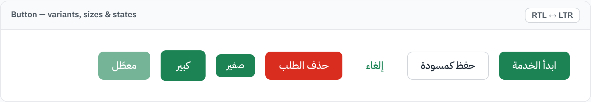
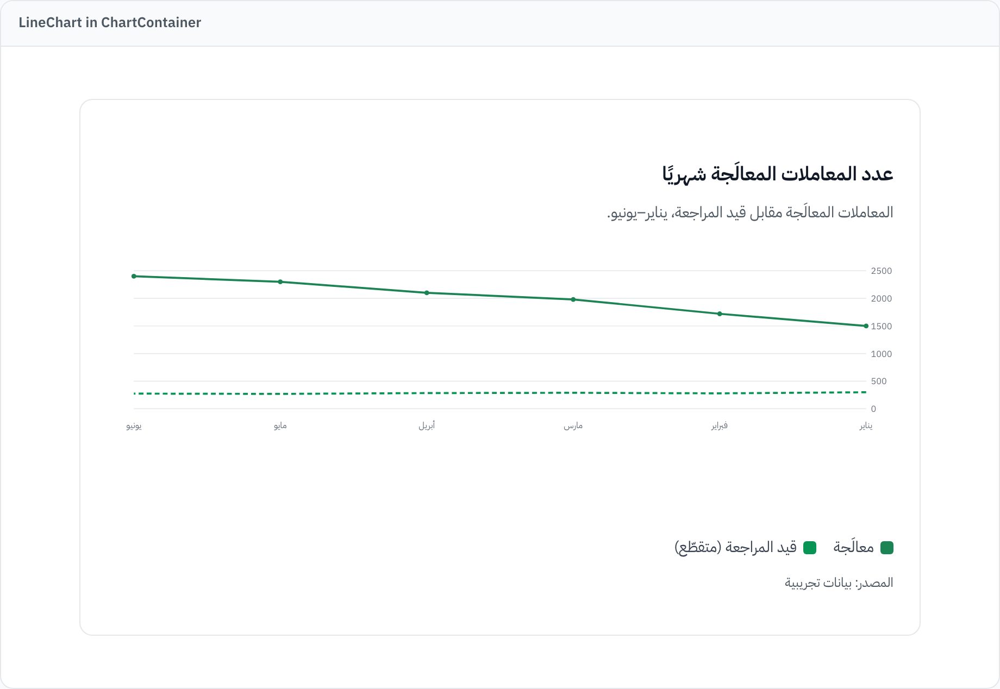
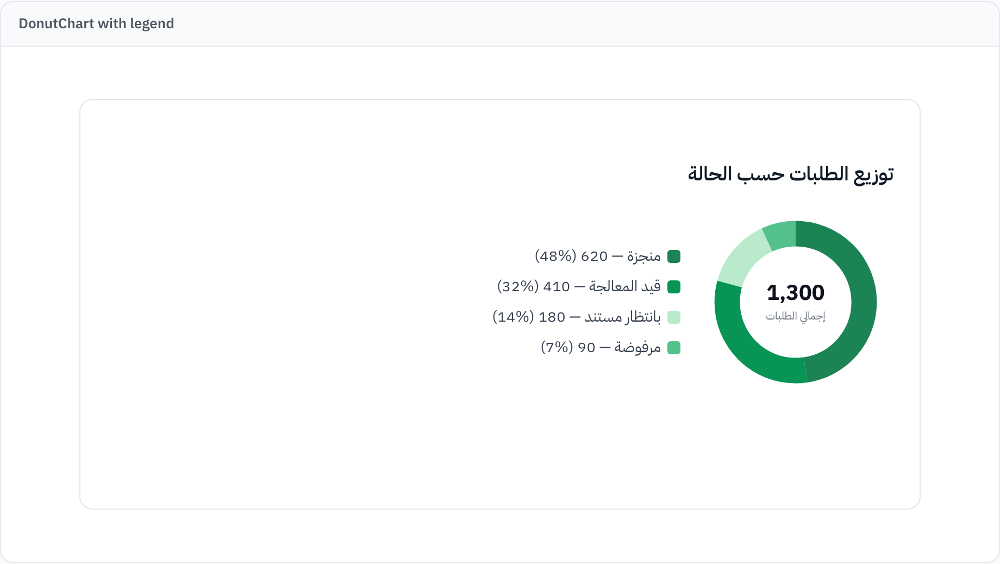
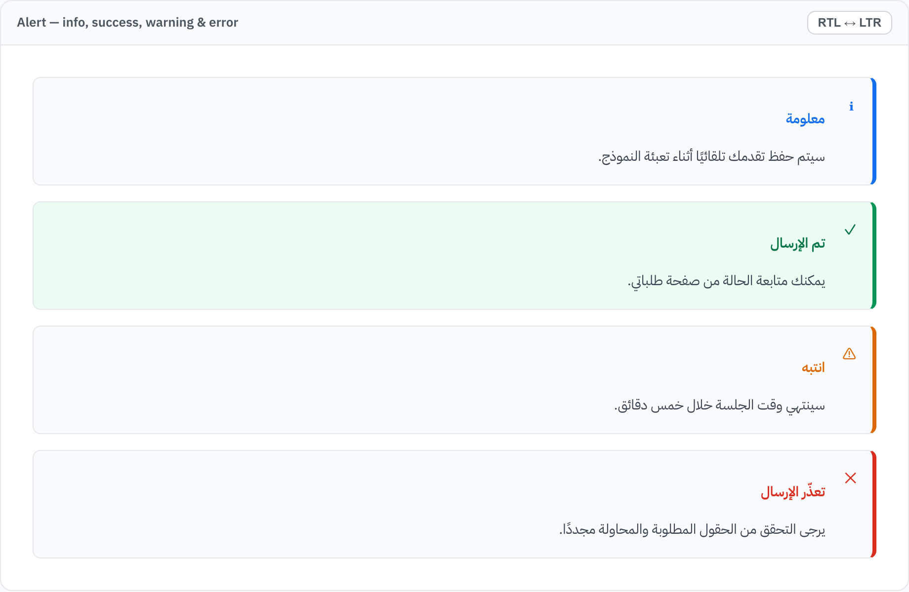
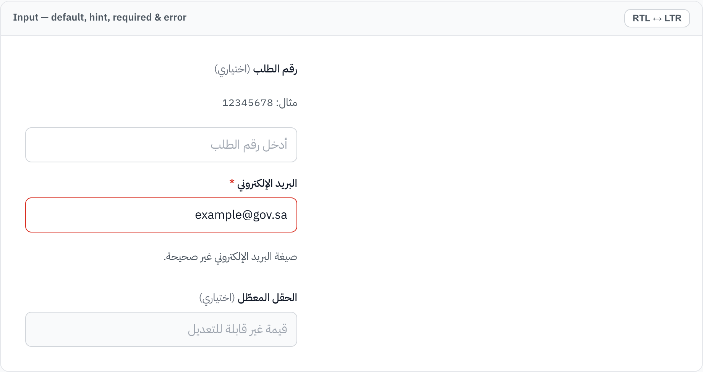
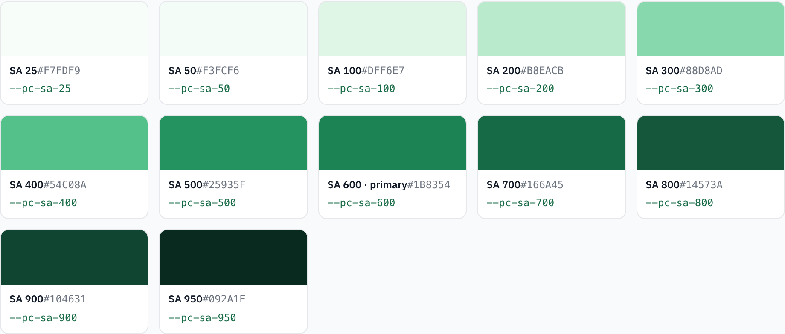
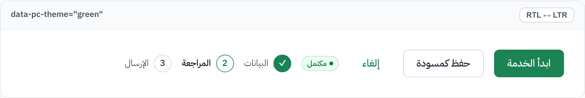
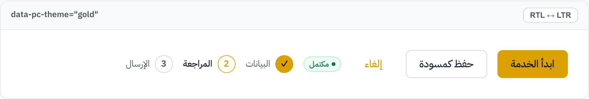
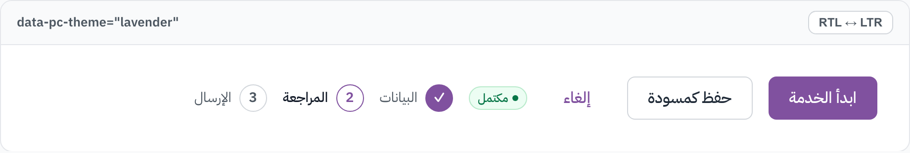

# dga-platforms-code-claude-skill

A reusable **Claude Code Skill** and reference repository for designing, auditing, refactoring, and
implementing Saudi government-style digital interfaces aligned with the Digital Government Authority
(DGA) **Platforms Code / كود المنصات** and the National Design System of Saudi Arabia.

This repository is an internal, government-grade design-engineering enablement asset. It is not a
casual prompt collection and not a substitute for official review.

---

## Grounding and scope

The guidance here is grounded in official DGA Platforms Code sources: the official **Platforms Code
Guide v1.0** (DGA, 17 November 2024), verified **typography page** content, the **layout and spacing**
source status, and a verified **semantic color** extraction (Semantic 600 values). Verified design
tokens live in [`claude/skills/dga-platforms-code/tokens/`](claude/skills/dga-platforms-code/tokens/).

Platforms Code is a **national reference for designing and developing government platform
interfaces**. It aims to improve user experience, unify government platform design, and provide a
smooth and inclusive digital experience for all users.

**Official objectives:**

- Consistent user experience.
- Unified reference for user interfaces.
- Contribution to international indicators.
- Digital inclusion support.

This repository provides **implementation alignment guidance only**. It does **not** certify official
compliance; formal compliance requires review by the responsible entity.

## Purpose

Public-sector and semi-government digital products must feel official, trustworthy, calm, accessible,
and correct in Arabic (RTL). This repository captures that intent as an operational Claude Code
Skill so that any team can produce interfaces that are:

- **Official and trustworthy** in visual tone.
- **Service-first** in structure (clear tasks, clear outcomes).
- **Accessible** by default (contrast, keyboard, semantics, screen readers).
- **Arabic RTL-correct**, including mixed Arabic/Latin content.
- **Consistent** across pages, components, and flows.
- **Engineered safely**, preserving business logic, APIs, auth, and validation.

## What the Skill does

When active, the Skill (`claude/skills/dga-platforms-code`) directs Claude Code to:

1. Inspect the project before changing anything (framework, routing, styling, component structure).
2. Read the bundled `references/` as operational design rules.
3. Make **incremental, UI-focused** changes while preserving logic, API contracts, authentication,
   authorization, and validation behavior.
4. Enforce Arabic RTL correctness, accessibility, responsive behavior, and government-grade tone.
5. Run available checks (lint, typecheck, build, tests).
6. Summarize changed files and the remaining manual-review items.

It also includes a token-driven set of **illustrative component templates** (`components/`) with
dependency-free **charts** and opt-in **accent theming** (switch the primary accent per service to a
verified palette — green / gold / lavender — while semantics, neutrals, and charts stay fixed), plus
reusable `prompts/`, adaptable React + Tailwind `templates/`, and generic, product-agnostic
`examples/`.

> **This is a Claude Code Skill, not a published npm package.** The bundled React/CSS under
> `components/` is **illustrative implementation guidance** to copy and adapt — it is **not** an
> installable package and **not** official DGA components. Do not `npm install` this repository.

## Documentation

A comprehensive, browsable HTML documentation site lives in [`docs/`](docs/). Open
[`docs/index.html`](docs/index.html) in a browser for a navigable reference covering the overview,
design principles, **verified design tokens** (color, typography, spacing, elevation), the
**component library** and **charts** with live previews, **accent theming**, the reference guides,
RTL & accessibility, templates, examples, and prompts. The component and chart previews are rendered
with the skill's own `tokens.css` / `components.css` / `charts.css`, so the docs always reflect the
verified tokens.

| | | |
|---|---|---|
|  |  |  |
| Buttons — RTL, token-driven | LineChart — right-to-left time axis | DonutChart — label · value · % |
|  |  |  |
| Alerts — meaning beyond color | Inputs — label, hint, error | SA palette — verified tokens |
|  |  |  |
| Accent theming — green (default) | Gold (dark text for contrast) | Lavender — semantics stay fixed |

> The docs are documentation only — they do not change the skill, tokens, or components, and assert
> no official DGA compliance.

## When to use it

- Building or restyling government / semi-government service interfaces.
- Auditing an interface for government-grade tone, RTL correctness, and accessibility.
- Converting an existing UI toward a Platforms Code-aligned visual language.
- Implementing service flows: selection, multi-step forms, upload/review/result, dashboards,
  verification and case-management screens.

## When **not** to use it

- Commercial/marketing sites that intentionally want a bold consumer brand.
- Tasks that are purely backend, data, or infrastructure with no UI surface.
- Anything that needs a **formal compliance statement** — this Skill cannot grant one (see below).
- Situations requiring exact official token values you have not verified against the official
  sources; the Skill deliberately avoids inventing token values.

## Install / copy the Skill

Personal skills directory (available across your projects):

```bash
mkdir -p ~/.claude/skills
cp -R claude/skills/dga-platforms-code ~/.claude/skills/
```

Project skills directory (shared with the repository, committed to version control):

```bash
mkdir -p .claude/skills
cp -R claude/skills/dga-platforms-code .claude/skills/
```

Claude Code discovers the skill from its `SKILL.md` front matter. No build step is required.

## Use it in a project

1. Copy the Skill as above.
2. Open the target project with Claude Code.
3. Ask for the task in natural language (for example: "Audit this service page for government-grade
   tone, RTL, and accessibility, and propose incremental fixes"). The Skill's description triggers
   activation automatically; you can also reference it explicitly.
4. For repeatable workflows, paste a prompt from `claude/skills/dga-platforms-code/prompts/`.
5. Review the change summary and complete the listed manual-review items before release.

## Official sources

The authoritative references are the DGA sources, not this repository:

- https://design.dga.gov.sa/
- https://design.dga.gov.sa/about-platforms-code
- https://dga.gov.sa/ar/digital-knowledge/national-design-system-of-Saudi-Arabia
- https://oss.dga.gov.sa/ar/products/dga-ac319-national-design-system
- https://design.dga.gov.sa/guidelines/templates
- https://design.dga.gov.sa/guidelines/foundations/color-system
- https://design.dga.gov.sa/guidelines/foundations/typography
- https://design.dga.gov.sa/guidelines/foundations/iconography
- https://design.dga.gov.sa/guidelines/components
- https://design.dga.gov.sa/guidelines/components/forms-and-inputs/steps
- https://my.gov.sa/en/content/accessibility

See [sources.md](sources.md) for how each source is used. Verified extractions are in
[references 13–16](claude/skills/dga-platforms-code/references/) and the token files under
[tokens/](claude/skills/dga-platforms-code/tokens/).

## Official libraries

Platforms Code provides official libraries (use as references when the project has access; do not
copy or redistribute their assets):

- **Figma design library** — tested, ready-to-use design tools and components.
- **Storybook developer tool** — build and document UI components in isolation before integration.
- **Mobile application library** — mobile UI elements and additional mobile components.

## Future outlook (vision note)

The Platforms Code Guide v1.0 mentions future support for innovative digital channels and
technologies such as virtual reality, augmented reality, artificial intelligence, generative AI, and
automation of design and development processes. This is a **vision note only** and is not an
implementation requirement of this Skill unless explicitly requested.

## Maintenance policy

- The files under `references/` are **operational summaries**. When the official sources change, the
  official sources win — update the summaries to match. See [GOVERNANCE.md](GOVERNANCE.md).
- Verify official links periodically using [tools/link-checklist.md](tools/link-checklist.md).
- Record source changes in [tools/source-update-log.md](tools/source-update-log.md).
- Track repository changes in [CHANGELOG.md](CHANGELOG.md).

## Compliance disclaimer

This repository helps **align** interfaces with DGA Platforms Code principles. It does **not** grant,
imply, or certify official DGA compliance. Official compliance requires formal review by the
responsible entity. Do not state or imply that an interface is officially DGA-compliant on the basis
of this Skill alone. See [GOVERNANCE.md](GOVERNANCE.md) and
[tools/manual-review-template.md](tools/manual-review-template.md).

## License

Released under the MIT License. See [LICENSE.md](LICENSE.md).
